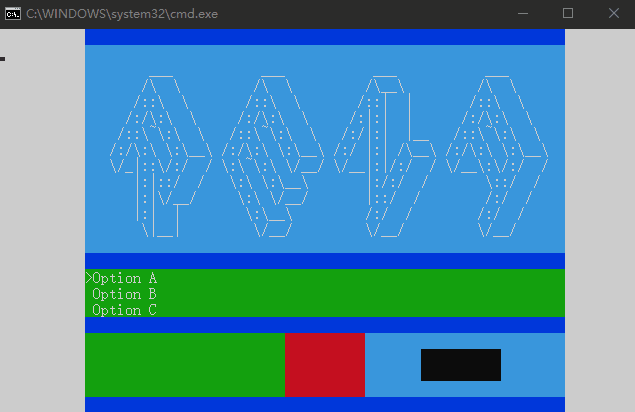

# Rena

Rena is a codebase for 2D terminal game in `Python`.

### Features

*Rena is still under very early stage of development.*

+ Linear layout support
+ Input support (implement with `keyboard`)
+ Colored double buffer rendering (implement with `colorama`)
+ Event Loop
+ "Select" control
+ Application
+ Page & route
+ Page life cycle
+ Udp logcat

### Known issue

+ Switch page when rendering new page cause wrong display result.

### TODO

+ More controls
+ Local storage
+ Networking
+ More layout methods
+ Assets management
+ Multi operating system / terminal emulator support
