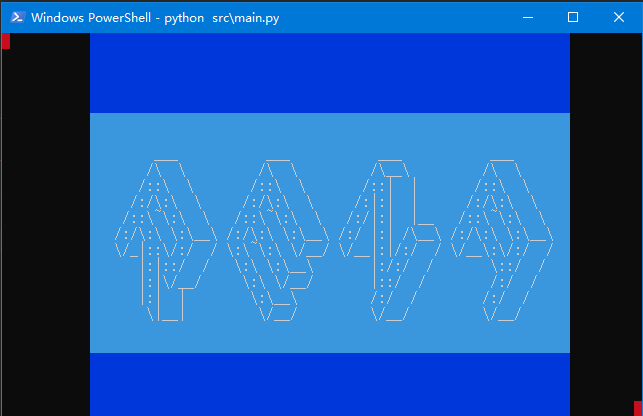

# Rena

Rena is a codebase for 2D terminal game in `Python`.

### Features

*Rena is still under very early stage of development.*

+ Linear layout support
+ Input support (implement with `keyboard`)
+ Colored double buffer rendering (implement with `colorama`)
+ Event Loop
+ "Select" control
+ Application
+ Page & router

### TODO

+ More controls
+ More layout methods
+ Assets management
+ Local storage
+ Networking
+ Multi operating system / terminal emulator support
